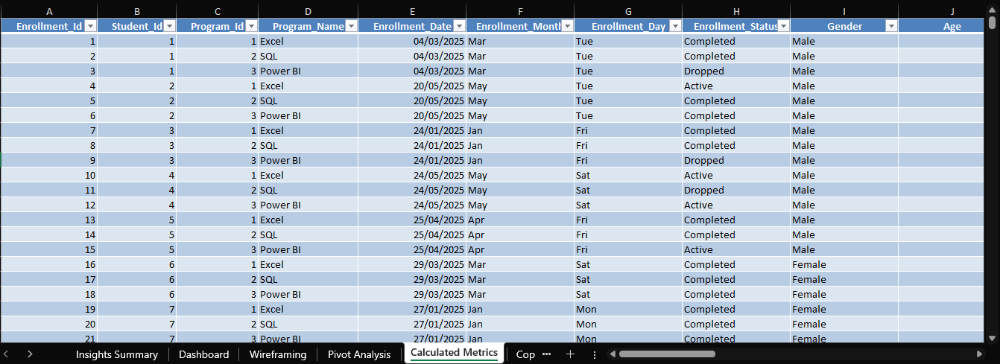
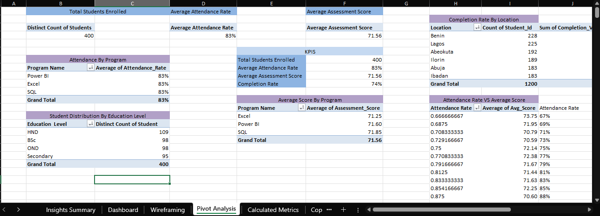
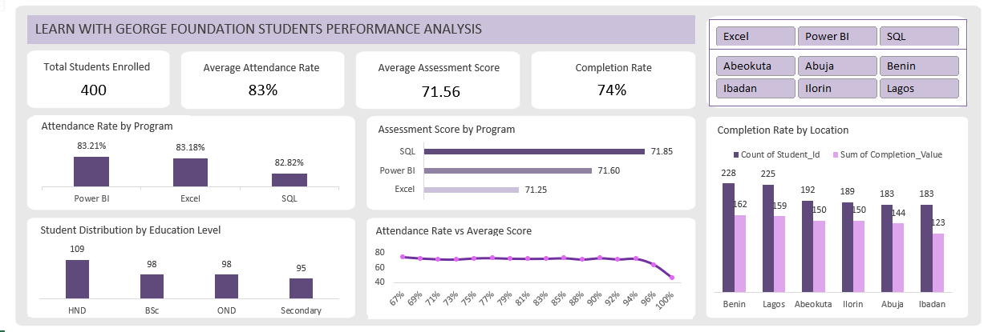

# NGO-Operational-Performance-Analysis

## Introduction
Learn with George is a non-governmental organization that runs free technology programs in Excel, SQL, and Power BI. The management has been concerned about how well the programs are performing on a day-to-day level; hence, they need better understanding of student attendance, learning performance and program completion outcomes. This project focuses on analyzing 6 months (January–June 2025) data to create an interactive Excel dashboard to monitor and report on training performance by analyzing attendance, student performance and completion outcomes.

## Problem Statement
Learn with George’s management team needed better visibility in the student attendance and program performance to improve the overall training outcome. The goal of this project is to design a single, user-friendly dashboard that answers key questions and enable stakeholders to track training performance thereby supporting strategic decision-making.

## Data Sourcing
This project used a simulated and anonymized dataset representing an NGO’s student performance tracking activities.
1.	**Source**: Simulated NGO student Performance data
2.	**Time Period**: January 2025 – June 2025
3.	**Records**: 1203 records
4.	**Key Fields**: 
  - Enrollment Date
  - Student ID
  - Program ID
  - Age
  - Gender
  - Attendance Rate
  - Assessment Score
  - Outcome Date
  - Location
  - Education Level
  - Program Name

## Data Transformation & Cleaning
Before analysis, the raw data was prepared in Power Query to ensure accuracy and consistency
1. Created a backup copy of the original dataset
2. Removed duplicate records
3. Standardized date formats and column naming conventions
4. Corrected inconsistent column labels
5. Created new calculated columns for:
  - **Attendance rate category**
  - **Completion rate**
  - **Score grade**
  - **Attendance status**
  - **Performance remark**

**View the cleaned dataset below**

## Analysis
The analysis was conducted primarily through calculated metrics and pivot tables to evaluate student performance trends and program effectiveness.
Key Performance Indicators (KPIs)
  - Total Students Enrolled
    A pivot table was used to calculate the total number of students enrolled across all programs and locations using the Student ID
  - Average Attendance Rate
    The average attendance rate was calculated using aggregated attendance values (Attendance Rate) 
  - Average Assessment Score
    The average assessment score was calculated using Assessment Score to evaluate overall academic performance.
  - Completion Rate (%)
    A calculated metric was created to measure program completion:
    Completion Rate (%) = (Number of students who completed the program / Total enrolled students) * 100

**View the Pivot analysis below**

## Dashboard & Visuals
The dashboard includes:
1. **KPI Cards**:
  - Total students enrolled
  - Average attendance rate
  - Average assessment score
  - Completion rate (%)
2. **Column Chart**: Attendance rate by program
3. **Bar Chart**: Assessment score by program
4. **Column Chart**: Student distribution by education level
5. **Line Chart**: Attendance rate vs average score
6. **Column Chart**: Completion rate by location
7. **Slicers**:
  - Program Name
  - Location

**View the dashboard below**

## Insights & Findings
  - **Total Students Enrolled**: 400
  - **Average Attendance Rate**: 83%
  - **Average Assessment Score**: 71.56
  - **Completion Rate (%)**: 74%
  - Attendance levels across all programs are great with an average of **83%**. While most students attend regularly, about **17%** of students have low attendance, indicating a gap in engagement that could affect completion outcomes.
  - Attendance differs between programs with Excel and Power BI having attendance rate of 83% and SQL having **82.8%**. The SQL program has the lowest average attendance at 82.8% but the highest average assessment score at **71.85**. This suggests that the students who do attend are engaged and perform well.
  - Student assessment scores also vary by program. Excel students average **71.25**, Power BI students average **71.60** and SQL students average **71.85**. Programs with higher attendance rate with low average assessment score like Excel shows that attendance alone doesn't guarantee high performance. Other factors like passive participation and challenge in delivery play a role.
  - Attendance generally supports better performance, but the relationship is not consistent across programs. For instance, SQL has lowest attendance (82.8%) but highest average score (71.85), while Excel has 83% but lowest score **71.25**. This shows that attendance is important but not the only factor affecting performance. Other factors like engagement and prior knowledge also play a role.
  - A total of **22** out of **1200** students (1.8%) are classified as at risk based on average score below **50**. Interestingly, these students that had attendance rate of about **70%** indicate that low attendance does not always translate into poor academic performance. However, the remaining at-risk students recorded lower scores, suggesting that reduced attendance still poses a risk to consistent performance and completion. This highlights the need for targeted individualized support rather than broad interventions, for students with lower attendance. Student ID 176 may need support, with 100% attendance rate in Power BI having an average score below **50**.

## Recommendations 
  - Targeted support for at-risk students. Follow-ups, academic check-ins can help improve engagement.
  - Strengthen Engagement, not just attendance. Focus on active learning, teaching quality and student engagement not attendance alone.
  - Identify effective teaching methods and learning structures from high performing programs and replicate in low performing programs.
  - Continuous Performance Review

## Conclusion 
This project delivered a clear overview of both the reach and effectiveness of the NGOs educational programs. By combining clean data, pivot analysis, and intuitive visuals, this dashboard and insights generated can help the NGO identify areas that require targeted support, improve student retention and enhance overall program effectiveness. Further analysis could incorporate instructor data, demographic data or time-based trends to further understand the drivers of student performance.
